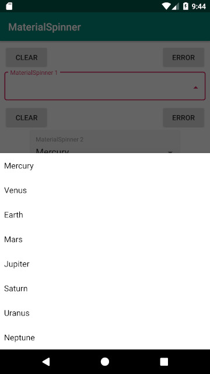

# MaterialSpinner


[](https://jitpack.io/#tiper/MaterialSpinner)
[](http://kotlinlang.org/)
[](https://ktlint.github.io/)
[](http://www.apache.org/licenses/LICENSE-2.0)


MaterialSpinner aims to provide a Material Design Spinner.

This widget is based on TextInputLayout.

For more information please check:
- [Spinner](https://developer.android.com/guide/topics/ui/controls/spinner)
- [Text Fields](https://material.io/develop/android/components/text-input-layout/)

## Screenshot
  

## Dependency

Add this in your root `build.gradle` file (**not** your module `build.gradle` file):

```gradle
allprojects {
    repositories {
        maven { url "https://jitpack.io" }
    }
}
```

Then, add the library to your module `build.gradle`
```gradle
dependencies {
    implementation 'com.github.tiper:MaterialSpinner:latest.release.here'
    implementation 'com.android.support:design:android.design.version.here'
}
```

If your using the [Material Components for Android](https://github.com/material-components/material-components-android), make sure you have `android.useAndroidX=true` and `android.enableJetifier=true` in your _gradle.properties_ file!

## Features
- Quick way to select a value from a list.
- Support for having no value selected or clearing it.
- Styling and theming just like for [TextInputLayout](https://developer.android.com/reference/android/support/design/widget/TextInputLayout).
- Showing a hint.
- Showing an error.
- Showing a prompt when `spinnerMode` is `dialog`.
- Showing a bottom sheet when `spinnerMode` is `bottomsheet`.
- Custom spinner drawables.
- RTL support.

## Usage
There is a [sample](https://github.com/tiper/MaterialSpinner/tree/master/sample) provided which shows how to use the library, but for completeness, here is all that is required to get MaterialSpinner working:

### XML:
```xml
<com.tiper.MaterialSpinner
    android:id="@+id/material_spinner"
    android:layout_width="match_parent"
    android:layout_height="match_parent"/>
```

If you want the options to be presented to the user as a dialog window just add:
```xml
app:spinnerMode="dialog"
```
If you want the options to be presented to the user as a bottom sheet window just add:
```xml
app:spinnerMode="bottomsheet"
```

### JAVA:
```java
final MaterialSpinner materialSpinner = findViewById(R.id.material_spinner);
materialSpinner.setAdapter(adapter);
```
### Kotlin (**with** synthetics):
```kotlin
material_spinner.adapter = adapter
```
That's it!

License
--------

    Copyright 2019 Tiago Pereira

    Licensed under the Apache License, Version 2.0 (the "License");
    you may not use this file except in compliance with the License.
    You may obtain a copy of the License at

       http://www.apache.org/licenses/LICENSE-2.0

    Unless required by applicable law or agreed to in writing, software
    distributed under the License is distributed on an "AS IS" BASIS,
    WITHOUT WARRANTIES OR CONDITIONS OF ANY KIND, either express or implied.
    See the License for the specific language governing permissions and
    limitations under the License.
